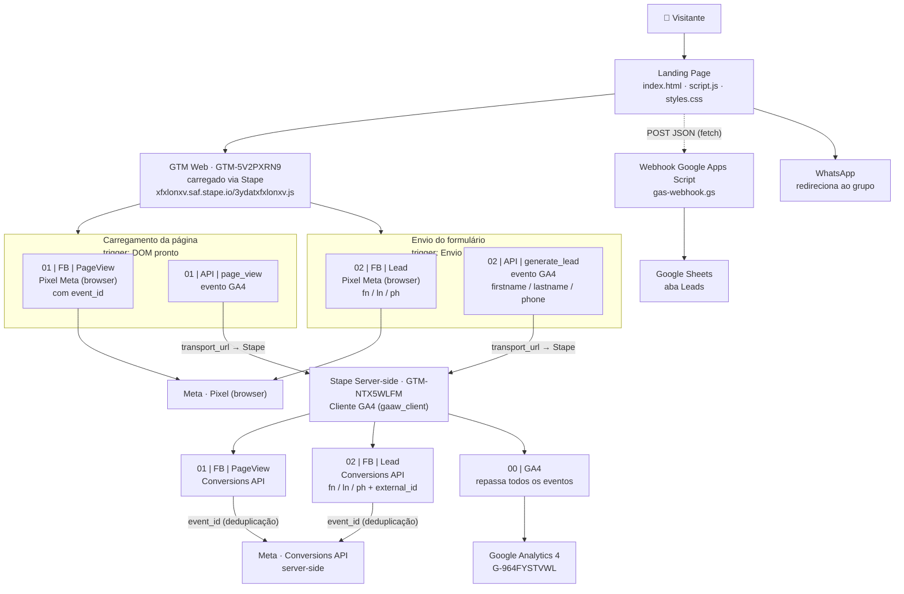

# Arquitetura — Gastronomida

Estrutura de coleta e armazenamento de dados da landing page: GTM Web carregado via
Stape, container server-side (sGTM), Google Analytics 4, Meta Pixel + Conversions API
e salvamento de leads no Google Sheets.

## Visão geral

---

## Container Web — `GTM-5V2PXRN9` (WEB)

Carregado pelo `index.html` via Stape (`xfxlonxv.saf.stape.io/3ydatxfxlonxv.js`),
substituindo o snippet oficial do Google — contorna ad blockers e mantém o gtag
apontando para o domínio próprio de medição (server-side).

### Tags

| Tag | Tipo | Dispara em | Envia |
|---|---|---|---|
| `0` Tag de Configuração | gtag (GA4) | All Pages | Inicializa GA4 (`G-964FYSTVWL`), `server_container_url` → Stape, `send_page_view=false` |
| `01` FB \| PageView | Meta Pixel (template da galeria do Facebook) | DOM pronto | PageView ao Pixel com `event_id` |
| `02` FB \| Lead | Meta Pixel (template da galeria do Facebook) | Envio de Formulário | Lead ao Pixel com `fn`, `ln`, `ph` |
| `01` API \| page_view | GA4 event | DOM pronto | `page_view` → Stape (sGTM) |
| `02` API \| generate_lead | GA4 event | Envio de Formulário | `generate_lead` com `firstname`, `lastname`, `phone` → Stape (sGTM) |

### Triggers

| ID | Nome | Tipo |
|---|---|---|
| 11 | DOM pronto | DOM_READY |
| 13 | Envio de Formulário | FORM_SUBMISSION (aguarda tags por 2 s) |

### Variáveis

| Variável | Tipo | Valor / Função |
|---|---|---|
| `0` Meta Pixel | constante | `472273409107102` |
| `0` id da Métrica | constante | `G-964FYSTVWL` |
| `transport_url` | constante | `https://xfxlonxv.saf.stape.io` |
| `event_id` | Unique Event ID (Stape) | ID único por evento — usado para deduplicar Pixel × CAPI |
| `input - first name` | Custom JS | lê `#name`, minúsculas, remove o sobrenome |
| `input - last name` | Custom JS | lê `#name`, minúsculas, retorna o último nome |
| `input - phone` | Custom JS | lê `#phone`, só dígitos, prefixo `55` |

---

## Container Server — `GTM-NTX5WLFM` (SERVER)

Rodando no Stape (`https://xfxlonxv.saf.stape.io`). Recebe os hits GA4 do container
web por meio do cliente GA4 e os repassa para Meta (Conversions API) e GA4.

### Clientes

| Cliente | Tipo |
|---|---|
| GA4 | `gaaw_client` |

### Tags

| Tag | Tipo | Trigger | Envia |
|---|---|---|---|
| `01` FB \| PageView | Facebook CAPI (template Stape) | page_view | PageView → Meta Conversions API |
| `02` FB \| Lead | Facebook CAPI (template Stape) | generate_lead | Lead → Meta CAPI com `fn`, `ln`, `ph`, `external_id` |
| `00` GA4 | GA4 server-side | Todos os Eventos - GA4 | repassa eventos ao GA4 (`G-964FYSTVWL`) |

### Triggers

| ID | Nome | Condição |
|---|---|---|
| 8 | page_view | `_event` = `page_view` E Client Name contém `GA4` |
| 9 | generate_lead | `_event` = `generate_lead` E Client Name contém `GA4` |
| 17 | Todos os Eventos - GA4 | Client Name contém `GA4` E Event Name ≠ vazio |

### Variáveis

| Variável | Tipo | Origem |
|---|---|---|
| `0` Meta Pixel | constante | `472273409107102` |
| `0` Token Meta | constante | access token da Conversions API |
| `0` Id da Métrica | constante | `G-964FYSTVWL` |
| `ed - firstname` | Event Data | `eventData.firstname` (vindo do generate_lead) |
| `ed - lastname` | Event Data | `eventData.lastname` |
| `ed - phone` | Event Data | `eventData.phone` |
| `X-Stape-User-Id` | Request Header | header → `external_id` |

---

## Fluxos

### PageView (visita)

1. A página carrega e o GTM Web é baixado do Stape.
2. `DOM pronto`: Pixel dispara `PageView` (browser) e o GA4 envia `page_view` para o Stape.
3. No sGTM, o trigger `page_view` dispara a tag CAPI `PageView` → Meta (deduplicada pelo `event_id`) e a tag `00 | GA4` repassa o evento ao GA4.

### Lead (formulário)

1. Visitante preenche nome e WhatsApp e envia o formulário.
2. `script.js` valida, envia o lead via `fetch` para o **webhook do Google Apps Script** (que grava na aba **Leads** do Google Sheets) e redireciona imediatamente ao grupo do WhatsApp.
3. O GTM detecta o envio (trigger `Envio de Formulário`):
   - Pixel dispara `Lead` no browser com `fn`/`ln`/`ph` (extraídos do formulário pelas variáveis Custom JS).
   - GA4 envia `generate_lead` com `firstname`/`lastname`/`phone` para o Stape.
4. No sGTM, o trigger `generate_lead` dispara a tag CAPI `Lead` → Meta (mesmos dados de usuário, hasheados em SHA-256 server-side, + `external_id`), e a tag `00 | GA4` repassa `generate_lead` ao GA4.

### Deduplicação Pixel × CAPI

O mesmo evento é enviado duas vezes para a Meta (Pixel no browser + CAPI no servidor).
A variável `event_id` (Unique Event ID) gera um identificador único por evento que
acompanha os dois disparos, permitindo que a Meta deduplique — contando cada conversão
apenas uma vez e melhorando a qualidade de match.

---

## Observações

- O Pixel da Meta não está mais no código da página: foi removido do `script.js` e
  agora é 100% gerenciado pelo GTM (browser + server-side).
- O GA4 é configurado com `send_page_view=false` e `server_container_url` — o envio
  passa pelo sGTM (Stape), preservando o endereçamento do anúncio e reduzindo bloqueio.
- O armazenamento dos leads (Google Sheets) é independente do tracking: funciona via
  `gas-webhook.gs` (Google Apps Script) mesmo se o GTM falhar, e vice-versa.
